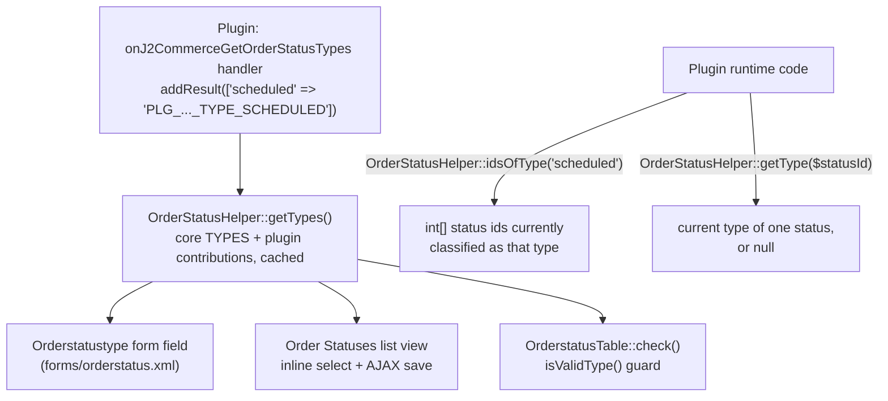

# Order Status Types

Since 6.6.1 (PR #2164), a plugin can register its own order-status lifecycle **type** — a merchant-facing classification such as `scheduled` for a partial-payments plugin — through the `onJ2CommerceGetOrderStatusTypes` event. Once registered, the type appears alongside the core set everywhere a status type is picked or displayed: the Order Status edit form, the Order Statuses list view's inline select, and the AJAX inline save.

## Why Types Instead of Ids

Order status ids are install-dependent. J2Store shipped six core statuses; J2Commerce ships eight. An id-preserving migration carries the source ids verbatim, and merchants add, rename and reorder their own rows on top of that. An id can never stand in for a fixed meaning across installs, so `OrderStatusHelper` puts the classification on the row itself (`orderstatus_type`) instead. A plugin should never hardcode a status id — it resolves the ids that currently carry its type at runtime with `OrderStatusHelper::idsOfType()`.

The type set describes **lifecycle only**, never payment state. Payment state has its own column, and `OrderPayGrantHelper::isPayable()` reads it independently. That is also why `delivered` is distinct from `complete` — a delivered cash-on-delivery order is still payable — and why `approved` exists for gateways that authorize now and capture later.

## Architecture



## Event Specification

| | |
|---|---|
| Event name | `onJ2CommerceGetOrderStatusTypes` |
| Fired by | `OrderStatusHelper::getTypes()` |
| Fired via | `J2CommerceHelper::plugin()->event('GetOrderStatusTypes', ['types' => <core TYPES>])` |
| Argument | `types` — the core set (`value => language key`). **Read-only.** Do not call `$event->setArgument()` on it. |
| Contribution method | `$event->addResult(['scheduled' => 'PLG_J2COMMERCE_APP_PARTIALPAYMENT_TYPE_SCHEDULED'])` |
| Contribution shape | One array per handler, `value => language key`. Values are strings, labels are language keys resolved through `Text::_()` by core. |
| Since | 6.6.1 |

## Step-by-Step

### 1. Subscribe to the event

```php
// File: plugins/j2commerce/app_partialpayment/src/Extension/AppPartialpayment.php

declare(strict_types=1);

namespace J2Commerce\Plugin\J2Commerce\AppPartialpayment\Extension;

\defined('_JEXEC') or die;

use Joomla\CMS\Plugin\CMSPlugin;
use Joomla\Event\Event;
use Joomla\Event\SubscriberInterface;

final class AppPartialpayment extends CMSPlugin implements SubscriberInterface
{
    protected $autoloadLanguage = true;

    public static function getSubscribedEvents(): array
    {
        return [
            'onJ2CommerceGetOrderStatusTypes' => 'onJ2CommerceGetOrderStatusTypes',
        ];
    }
}
```

### 2. Add the language strings

Register the type's label as a language key in the plugin's own `.ini` — never in core's `com_j2commerce.ini`:

```ini
; File: plugins/j2commerce/app_partialpayment/language/en-US/plg_j2commerce_app_partialpayment.ini
PLG_J2COMMERCE_APP_PARTIALPAYMENT_TYPE_SCHEDULED="Scheduled"
```

Add the same key to `plg_j2commerce_app_partialpayment.sys.ini`, and mirror both files to `administrator/language/en-US/` — a stale admin mirror wins over the plugin folder copy and the key renders as its raw name (`loadLanguage()` short-circuits on `load(admin) || load(pluginFolder)`).

`$autoloadLanguage = true` loads the plugin's language file automatically for admin requests; that is what makes `Text::_('PLG_J2COMMERCE_APP_PARTIALPAYMENT_TYPE_SCHEDULED')` resolve when core renders the type select.

### 3. Register the type in the handler

```php
    public function onJ2CommerceGetOrderStatusTypes(Event $event): void
    {
        $event->addResult(['scheduled' => 'PLG_J2COMMERCE_APP_PARTIALPAYMENT_TYPE_SCHEDULED']);
    }
```

Do not read or modify the `types` argument — it is the core set, provided for reference, not for the handler to append to. Contribute with `addResult()` instead; `OrderStatusHelper::getTypes()` merges every handler's result array into the final set after validating it.

### 4. Use the type in your own params XML

```xml
<!-- File: plugins/j2commerce/app_partialpayment/app_partialpayment.xml (excerpt) -->
<config>
    <fields name="params" addfieldprefix="J2Commerce\Component\J2commerce\Administrator\Field">
        <field
            name="scheduled_status_id"
            type="Orderstatustype"
            label="PLG_J2COMMERCE_APP_PARTIALPAYMENT_SCHEDULED_STATUS_LABEL"
            description="PLG_J2COMMERCE_APP_PARTIALPAYMENT_SCHEDULED_STATUS_DESC"
            default=""
        />
    </fields>
</config>
```

Once registered, `scheduled` appears in this `Orderstatustype` select automatically — there is nothing extra to wire up in the plugin's own form.

### 5. Resolve ids at runtime

Never hardcode a status id. Ask `OrderStatusHelper` for the ids currently carrying the type:

```php
use J2Commerce\Component\J2commerce\Administrator\Helper\OrderStatusHelper;

// All status ids a merchant has classified as "scheduled".
$scheduledIds = OrderStatusHelper::idsOfType('scheduled');

// Or check a single status.
if (OrderStatusHelper::getType($order->order_status_id) === 'scheduled') {
    // ...
}
```

`idsOfType()` returns an empty array for a type nobody has assigned yet — including a type your own plugin registers but that the merchant has not picked in the Order Statuses screen.

## Acceptance Rules

| Rule | Detail |
|---|---|
| Value pattern | Must match `^[a-z][a-z0-9_]{0,15}$` — lowercase, starts with a letter, max 16 characters (the `orderstatus_type` column is `varchar(16)`). |
| Label | Must be a non-empty string (a language key). |
| Core collision | A value equal to an existing core key (`new`, `open`, `approved`, `shipped`, `delivered`, `complete`, `cancelled`, `failed`, `refunded`) is ignored — core can never be overridden. |
| Anything else | Silently dropped — a malformed contribution does not fail the whole event. |
| Ordering | Core entries come first in the merged set (so the select keeps core ordering); plugin entries follow in registration order. |

## Runtime Behavior

- **Cached per request.** `OrderStatusHelper::getTypes()` caches the merged set in a static property for the life of the request. Call `OrderStatusHelper::clearCache()` if you write the column and need to re-read the type set in the same request (`OrderstatusesModel::saveTypes()` does this after every write).
- **No recursion.** The static cache is pre-assigned to the core set before the event dispatches, so a handler that calls back into `OrderStatusHelper` during the event sees the core set only, not an infinite loop.
- **Dispatch failure falls back to core.** If a handler throws, core catches it, logs at `Log::WARNING` under the `com_j2commerce` category, and continues with the core set — a broken plugin cannot break the Order Statuses screen.
- **Disabled plugin, still-classified rows.** Disabling the plugin does not touch the database. Rows keep their stored `orderstatus_type` value. `OrderStatusHelper::getType()` and `idsOfType()` then treat that value as unclassified (`null`, since `isValidType()` returns `false` for an unregistered value). The list view still shows the raw stored value (escaped) rather than "Not classified" — `getTypeLabel()` returns the value itself when it is not found in the current type set. The edit form's `Orderstatustype` field will not offer that stale value as a valid option and requires picking a currently-registered type before the row saves.

## Core Types Reference

| Value | Constant | Language key |
|---|---|---|
| `new` | `OrderStatusHelper::TYPE_NEW` | `COM_J2COMMERCE_ORDERSTATUS_TYPE_NEW` |
| `open` | `OrderStatusHelper::TYPE_OPEN` | `COM_J2COMMERCE_ORDERSTATUS_TYPE_OPEN` |
| `approved` | `OrderStatusHelper::TYPE_APPROVED` | `COM_J2COMMERCE_ORDERSTATUS_TYPE_APPROVED` |
| `shipped` | `OrderStatusHelper::TYPE_SHIPPED` | `COM_J2COMMERCE_ORDERSTATUS_TYPE_SHIPPED` |
| `delivered` | `OrderStatusHelper::TYPE_DELIVERED` | `COM_J2COMMERCE_ORDERSTATUS_TYPE_DELIVERED` |
| `complete` | `OrderStatusHelper::TYPE_COMPLETE` | `COM_J2COMMERCE_ORDERSTATUS_TYPE_COMPLETE` |
| `cancelled` | `OrderStatusHelper::TYPE_CANCELLED` | `COM_J2COMMERCE_ORDERSTATUS_TYPE_CANCELLED` |
| `failed` | `OrderStatusHelper::TYPE_FAILED` | `COM_J2COMMERCE_ORDERSTATUS_TYPE_FAILED` |
| `refunded` | `OrderStatusHelper::TYPE_REFUNDED` | `COM_J2COMMERCE_ORDERSTATUS_TYPE_REFUNDED` |
| *(unclassified)* | — | `COM_J2COMMERCE_ORDERSTATUS_TYPE_NONE` ("Not classified") |

The select's field label key is `COM_J2COMMERCE_FIELD_ORDERSTATUS_TYPE`.

## Best Practices

- Never hardcode a status id. Resolve ids with `OrderStatusHelper::idsOfType()` or check one with `getType()` — ids are install-dependent, types are not.
- Keep the value short and specific (`scheduled`, not `partial_payment_scheduled_status`) — the column caps at 16 characters and a value over that is silently rejected.
- Register exactly one type per distinct lifecycle meaning your plugin introduces. Do not try to register a value that duplicates a core key to "extend" its meaning — core always wins and the contribution is dropped.
- Treat the type as lifecycle only. If your plugin needs a payment-state signal, use `OrderPayGrantHelper::isPayable()` instead — do not overload a status type for that purpose.
- Call `OrderStatusHelper::clearCache()` after any code path that writes `orderstatus_type` directly, so the next read in the same request sees the change.

## Troubleshooting

### The type shows as a raw language key instead of a label

**Cause:** The plugin's language file is not loaded, or the `administrator/language/` mirror is stale and is shadowing the plugin folder copy.

**Solution:**

1. Confirm `protected $autoloadLanguage = true;` is set on the plugin class, or call `$this->loadLanguage()` before the type is read.
2. Diff the plugin's `.ini`/`.sys.ini` against `administrator/language/<tag>/` — the admin copy must match exactly.
3. Run `php cli/joomla.php cache:clean` and reload.

### The type never appears in the select

**Cause:** The value fails the `^[a-z][a-z0-9_]{0,15}$` pattern, collides with a core key, the label is empty, or the plugin is disabled.

**Solution:**

1. Check the value is lowercase, starts with a letter, and is 16 characters or fewer.
2. Confirm it does not match any of the nine core values listed above.
3. Confirm the plugin is enabled — a disabled plugin's `getSubscribedEvents()` never fires.
4. Confirm the handler calls `$event->addResult([...])`, not `$event->setArgument('types', ...)` — the `types` argument is read-only context, not the contribution channel.

### Saving the order status is rejected

**Cause:** `OrderstatusTable::check()` and the inline AJAX save (`OrderstatusesController::ajaxSaveType()`) both validate the submitted value through `OrderStatusHelper::isValidType()`. The same three causes above (invalid pattern, core collision, disabled plugin) will reject a save.

**Solution:** Fix the registration per the causes above, then retry the save — no cache needs clearing on the write path, since `OrderstatusesModel::saveTypes()` calls `OrderStatusHelper::clearCache()` itself after every write.

## Related

- [OrderstatustypeField Field Type](../../fields/orderstatustype-field.md)
- [OrderStatusField Field Type](../../fields/orderstatus-field.md)
